# Automatic zone placement service

In Kubernetes, it is not possible to schedule Pods for optimal network performance, when the Pod is using resources outside of the cluster.

I've made a solution to overcome this. It will ensure that your SQL client Pods are scheduled to the same AWS availabilty zone that your AWS RDS Writer instance are in, by enabling the scheduling components in Kubernetes to be aware of the network topology outside of the cluste. It works for any external resource as long as it resolved

Does it matter? Yes, a simple `pgbench` benchmark demonstrates a ~175% to ~375% improvement in TPS. Any workload that is latency sensitive can benefit from this,

This is _not_ a fix for placing related workloads running in the same cluster, relative near each other. That is a fixed problem in Kubernetes with affinity rules and smart use of label selectors.

The basic problem is that the scheduler in Kubernetes is unaware of the network topology it is running on, so node assigment for Pods becomes random. For instance, assume your RDS Writer Instance is running in AZ C, kubernetes is not able to determine that it should (ideeally) schedule your SQL client Pod in AZ C:

```mermaid
---
config:
  layout: fixed
---
flowchart TD
 subgraph subGraph0["Kubernetes Control Plane"]
        K8sAPI["K8s API Server"]
  end
 subgraph subGraph1["Availability Zone a"]
        Pod["SQL Client Pod
        I should be in zone C 🙁"]
        NodeA["K8s Node"]
  end
 subgraph subGraph2["Availability Zone b"]
        NodeB["K8s Node"]
  end
 subgraph subGraph3["Availability Zone c"]
        RDS[("RDS Writer Instance")]
        NodeC["K8s Node"]
  end
 subgraph subGraph4["AWS Region (eu-central-1)"]
        subGraph1
        subGraph2
        subGraph3
  end
    K8sAPI -- schedules pod by random (unaware of RDS location) --> Pod
    Pod -- "High Latency / Cross-AZ Traffic" --> RDS
    style K8sAPI fill:#D92A2A,stroke:#333,stroke-width:2px,color:#fff
    style Pod fill:#FF9900,stroke:#333,stroke-width:2px,color:#fff
    style RDS fill:#5A30B5,stroke:#333,stroke-width:2px,color:#fff
```



By making network topology information available for the scheduler, we can allow it to make informed decissions. The best case for our workload is to be placed in the same AZ as the RDS instance it is communicating with:

```mermaid
graph TD
    subgraph "Kubernetes Control Plane"
        K8sAPI["K8s API Server"]
    end

    subgraph "AWS Region (eu-central-1)"
        subgraph "Solution Components"
            Kyverno["Kyverno Policy
            (Mutating Webhook)"]
            Lookup["Lookup Service"]
            Kyverno -- "gets location data" --> Lookup
        end

        subgraph "Availability Zone a"
            NodeA["K8s Node"]
        end
        subgraph "Availability Zone b"
            NodeB["K8s Node"]
        end
        subgraph "Availability Zone c"
            Pod["SQL Client Pod
            Minimal latency 😀"]
            RDS[(RDS Instance)]
            NodeC["K8s Node"]
        end
    end

    K8sAPI -- "admission controller,
    triggers webhook on Pod creation" --> Kyverno
    Lookup -. "perform informed / optimal placement of Pod" .-> Pod
    Pod -- "Low Latency" --> RDS

    style Pod fill:#FF9900,stroke:#333,stroke-width:2px,color:#fff
    style RDS fill:#5A30B5,stroke:#333,stroke-width:2px,color:#fff
    style Kyverno fill:#2771e2,stroke:#333,stroke-width:2px,color:#fff
    style Lookup fill:#2771e2,stroke:#333,stroke-width:2px,color:#fff
    style K8sAPI fill:#D92A2A,stroke:#333,stroke-width:2px,color:#fff
```



Manually setting a Node Affinity rule in the Pod spec fixes this temporary, but in a multi node RDS cluster, the role of the instance (Reader or Writer) can change over time as a result of maintance events, like patching, instance resizing or similar.

## Why ?

I was working on a platform team that got rather special support request: "Our application is _slower_ in production, help?". Turned out that that their production workload was (by chance) deployed in another zone than their RDS instance. Apperantly, cross-AZ latency is actually relative large compared to same-zone latency. Hence this solution.

## How ?

Kubernetes does not have a native solution for this specific issue: "How can I schedule Pods relative near to a resouce it is using, when this resource is outside the context of the cluster, and Kubernetes have no knowledge about this specific resource?".

The first step is to provide an API endpoint that is able to determine which zone a particular resource is located in. This endpoints accepts domain names, which it can resolve and map to a specific AWS availbility-zone. We are assuming the Pod has a domain name it uses to reach the external service, e.g, rhe RDS Writer instance FQDN:

```sh
$ curl --silent localhost:8080/my-rds-instance.cluster-c7eeqk68ktn1.eu-central-1.rds.amazonaws.com | jq
{
  "zone": "eu-central-1b",
  "zoneId": "euc1-az3"
}
```

The above endpoint is a very simple Python application that has been feed with all relevant subnet information. With this, we can make a mutating webhook in Kubernetes to ensure that Pods using external resources, as deployed to the optimal availbility zone.

With this information, one can use a mutating webhook (via e.g. Kyverno a ClusterPolicy) to alter the Pod specification when a Pod is created, and instruct it to attempt to place the Pod in the correct availbility zone, for instance via node affinity rules

## Tell me everything

For this to work, you need the following present in your Kubernetes environment:

- Kyverno (or OPA, or create your own mutatingpolicies to work in a similar fashion)
- A workload in Kubernetes that communicates with an external resource via FQDN
- The FQDN needs to return a _single_ A record for the external resource
- Zone information about your subnets

To gather zone information, use this command and bring the output into the `SUBNETS_DATA` array in `resources/server.py`:

```sh
$ aws ec2 describe-subnets --query 'Subnets[*].{CIDRBlock:CidrBlock, AvailabilityZone:AvailabilityZone, AvailabilityZoneId:AvailabilityZoneId}' --output json | jq '.[]' -c | sort | uniq | sed 's/$/,/g' | sed '$s/\,$//g'
{"CIDRBlock":"10.0.192.0/20","AvailabilityZone":"eu-central-1b","AvailabilityZoneId":"euc1-az3"},
{"CIDRBlock":"192.168.0.0/19","AvailabilityZone":"eu-central-1b","AvailabilityZoneId":"euc1-az3"},
{"CIDRBlock":"192.168.128.0/19","AvailabilityZone":"eu-central-1a","AvailabilityZoneId":"euc1-az2"},
{"CIDRBlock":"192.168.160.0/19","AvailabilityZone":"eu-central-1c","AvailabilityZoneId":"euc1-az1"},
{"CIDRBlock":"192.168.32.0/19","AvailabilityZone":"eu-central-1a","AvailabilityZoneId":"euc1-az2"},
{"CIDRBlock":"192.168.64.0/19","AvailabilityZone":"eu-central-1c","AvailabilityZoneId":"euc1-az1"},
{"CIDRBlock":"192.168.96.0/19","AvailabilityZone":"eu-central-1b","AvailabilityZoneId":"euc1-az3"}
```

Note: Having multiple AWS Accounts, VPC peerings or Transit Gateways? Map them as well. This will enable you to optimize Pod placement for even more external resources.

The Python lookup service is available at `resources/server.py`. In this example I'm using Kyverno, so lets deploy the application there. `resources/automatic-zone-lookup.yaml` deploys a single Pod with a Service called `automatic-zone-placement` which Kyverno can utilize.

Deploy the automatic-zone-placement service:

```sh
$ cd resources/
$ kubectl create configmap --from-file=server.py -n kyverno automatic-zone-placement
configmap/automatic-zone-placement created
$ kubectl create -f automatic-zone-lookup.yaml -n kyverno
service/automatic-zone-placement created
deployment.apps/automatic-zone-placement created
```

Now you have an internal endpoint that can lookup zone information for external services. Lets query for my RDS Writer Instance endpoint to see which zone it in:

```sh
$ kubectl port-forward service/automatic-zone-placement -n kyverno 8080:8080 &
Forwarding from 127.0.0.1:8080 -> 8080
Forwarding from [::1]:8080 -> 8080
$ curl --silent localhost:8080/my-rds-instance.cluster-c7eeqk68ktn1.eu-central-1.rds.amazonaws.com | jq
Handling connection for 8080
{
  "zone": "eu-central-1b",
  "zoneId": "euc1-az3"
}
```

Lets verify if this is indeed correct:

```sh
$ aws rds describe-db-clusters \ # Lookup which instance is the current writer
    --db-cluster-identifier my-rds-instance \
    --profile demo \
    --query "DBClusters[].DBClusterMembers[?IsClusterWriter == \`true\`].DBInstanceIdentifier | [0]" \
    --output text
my-rds-instance-instance-2
% aws rds describe-db-instances \ # Verify instanse is bound to the expexted AZ
    --db-instance-identifier my-rds-instance-instance-2 \
    --profile demo \
    --query "DBInstances[0].AvailabilityZone" \
    --output text
eu-central-1b
```

It sure is!

With this, I can instruct the scheduler in Kubernetes to lookup information before doing a node assignment for a Pod. Now the magic sauce: A Kyverno ClusterPolicy. Review the ClusterPolicy in `resources/kyverno_clusterpolicy.yaml`. What this policy will do, is look for `Pod.CREATE` operations, and if it has a annotations key `automatic-zone-placement` present, it will call our automatic-lookup-service to determine which zone it should assign the Pod to.

Let's apply the policy and test it:

```sh
$ kubectl apply -f kyverno_clusterpolicy.yaml
clusterpolicy.kyverno.io/automatic-zone-placement created
```

Now lets deploy a pod which has the required anotations key, and see how the actual Pod spec is after the mutation:

```sh
$ echo '---
apiVersion: v1
kind: Pod
metadata:
  name: pgbench-with-annotation
  annotations:
    automatic-zone-placement: my-rds-instance.cluster-c7eeqk68ktn1.eu-central-1.rds.amazonaws.com
spec:
  containers:
  - name: postgres
    image: postgres:15-bullseye
    command:
    - "/bin/bash"
    - "-c"
    - |
      echo "SELECT 1;" > /tmp/sql
      export PGPASSWORD=postgresqlpassword
      while true; do
        pgbench -h my-rds-instance.cluster-c7eeqk68ktn1.eu-central-1.rds.amazonaws.com -U postgresql -r -f /tmp/sql -T 9 -n postgres 2>&1 | grep -e tps -e latency
      done' | kubectl apply -f -
pod/pgbench-with-annotation created
```

We know that this Pod should ideally be placed in zone eu-central-1b, was it ?

```sh
$ kubectl get pod pgbench-with-annotation -o json | jq '.spec.affinity'
{
  "nodeAffinity": {
    "preferredDuringSchedulingIgnoredDuringExecution": [
      {
        "preference": {
          "matchExpressions": [
            {
              "key": "topology.kubernetes.io/zone",
              "operator": "In",
              "values": [
                "eu-central-1b"
              ]
            }
          ]
        },
        "weight": 100
      }
    ]
  }
}
```

Yes it was! Note, that we did not specify a nodeAffinity rule when we created the Pod. This was added by Kyverno with the ClusterPolicy we added earlier.

We can verify that our lookup service was used to get information about the external workload by checking the logs:

```sh
$ kubectl logs -n kyverno deployment/automatic-zone-placement
[...]
2025-08-28 21:42:45,693 - INFO - Resolved my-rds-instance.cluster-c7eeqk68ktn1.eu-central-1.rds.amazonaws.com to IP address: 192.168.99.255
2025-08-28 21:42:45,694 - INFO - Found matching zone data for IP 192.168.99.255
2025-08-28 21:42:45,694 - INFO - 192.168.154.51 - "GET /my-rds-instance.cluster-c7eeqk68ktn1.eu-central-1.rds.amazonaws.com HTTP/1.1" 200 -
[...]
```

## How big is the performance difference?

Big enough to care? Running `pgbench` with a simple `SELECT 1;` query in a loop, one in each availbility zone, it easy to spot the performance difference. Below is an output from a Deployment with 3 replicas, one Pod per zone, _without_ the annotation key which enables the automatic placement service. Can you spot which Pod is running in the same AZ as its RDS instance?

```
pgbench-6544568f8b-72kx5 latency average = 0.147 ms
pgbench-6544568f8b-72kx5 tps = 6793.317768 (without initial connection time)
pgbench-6544568f8b-7h4dk latency average = 0.704 ms
pgbench-6544568f8b-7h4dk tps = 1420.275917 (without initial connection time)
pgbench-6544568f8b-25vsx latency average = 0.404 ms
pgbench-6544568f8b-25vsx tps = 2473.397971 (without initial connection time)
```

Thats a 175% to 375% performance improvement!

For anyone working with networking, this isn't really a surprise. Lower latency means improved performance, and for an SQL application reduced latency adds up when measuring performance via TPS.

AWS publish intra-zone latency metrics for each zone in all regions via their [Network Manager > Infrastructure Performance](https://eu-central-1.console.aws.amazon.com/nip/) page. At the time of writing, the following latency metrics was:

```
Cross-AZ latency:
euc1-az1 to euc1-az2: 0.656 ms
euc1-az2 to euc1-az3: 0.548 ms
euc1-az3 to euc1-az1: 0.458 ms

Inter-AZ latency:
euc1-az1 to euc1-az1 0.104 ms
euc1-az2 to euc1-az2 0.119 ms
euc1-az3 to euc1-az3 0.107 ms
```

The above data shows that within the same region, one should expect a latency of ~0.100 ms. But, if your application has to traverse to another zone in the same region, the latency increases to ~450 ms ~0.650 ms. This increase in cross-AZ latency matches roughly the performance gains shown previously.

So that math check out.

# How to test locally without Kubernetes

The `server.py` has some example CIDR ranges already which can be used to test the endpoint locally.

```sh
$ python3 ./resources/server.py &
[...]
$ curl localhost:8080/192.168.0.1.nip.io | jq
{
  "zone": "eu-central-1b",
  "zoneId": "euc1-az3"
}
$ curl localhost:8080/192.168.32.1.nip.io | jq
{
  "zone": "eu-central-1a",
  "zoneId": "euc1-az2"
}
```

Beware that your local DNS resolver might implement DNS rebinding protection, which may result in failure to resolve local and private IP addresses. Using nip.io won't work in that case, and you will get this error:

```json
{
  "error": "FQDN not found or could not be resolved"
}
```

# Summary

This solution shows how one can increase performance by ~175%-375%, by adding additional meta-data for the kube-scheduler to use to make informative Pod placement. OK, thats not really correct, but it sounds better. What this solution really does is ensuring _consistent_ performance by placing the Pods in the correct availbility zone. One could said you avoid performance degrations or performance variance, but thats as cool to talk about.

I think this approach can be very valuable for those who require low latency or want to reduce cross-AZ data transfer cost. I wouldn't be surprised if this approach could be used for on-prem as well, as long as there is sufficient meta-data available.

Got a physical database in Rack A, Row 2 in DC 1? _Most likely_ the network performance is best at the rack level, so you could have a lookup policy that would return that the Pod placement should in Rack A, then Row 2 and a definitly in DC 1.

This could be used with strechted Kubernetes clusters with AWS Outpost as well.

For endpoints that returns multiple A records, lets say you have fqdn that resolves to all resources of same type, for example, your READ only pools of databases, this does not work. I'm working on a solution for this as well. Lets say you have a central logging component in Kubernetes that ships logs via an external Application Load Balancer in AWS, it would be nice to instruct the client to use the load balancer IP that is in the same availbity zone. This avoid cross-AZ transfer cost and latency.

# FAQ

<details>
<summary>This seems really unpolished ?</summary>

And it kinda is, but the concept is valuable. I'm not sure how I would package this as a ready made solution. Open for input. I like the fact that it is rather "stable". The lookup service works without any external dependecies, and can be used by Kyverno or other similar solutions. Of course the Python code could be more robust, it could be Golang istead (yay Cloud Native or something), the CIDR information could be a configmap (would require additional permissions), the CIDR list could be dynamically fetched (increased the complexity, especially in multi account setups).

</details>

<details>
<summary>Why do you have zone and zoneId ? Isn't the first sufficent? </summary>

Because your eu-central-1a is probably different from my eu-central-1a. "AWS maps the physical Availability Zones randomly to the Availability Zone names for each AWS account.": https://docs.aws.amazon.com/ram/latest/userguide/working-with-az-ids.html

The availbility zone ID is the same for everyone.

</details>

<details>
<summary>Have you considered solving this using X ?</summary>

I've been through a lot of options. Short list of items and short explantion on why I didnt try it:

- Add a step in the deployment pipeline to modify the manifest spec. Invovles permissions extra permissions and complexity, if the RDS instance is relocated the pipeline has to retrigger. No thanks.
- Sidecar that monitors the location of the external resources. Just no, again adds complexity since the Pod nown has to get permission to query the cloud API.
- Custom application that monitors for changes in cloud resources. Same as above, permissions, complexity.
- Adding the nodeAffinity rule on `{Deployment|StatefulSet|CronJob|...}` level. You could, but in our case we wanted the placement to be optimal at the time of scheduling the Pod itself. You could of course update the Deployment spec at intervals, but we didnt want our Pods to reschudule themselves in our case.

</details>

<details>
<summary>Does this work in GCP or Azure ?</summary>

As is, no. Kinda. In AWS, subnets are zonal resources, meaning they are only available in that specific zone at any given time. This makes it easy to make a lookup service, since you know IP addresses in the given ranges won't magically relocate to another zone. Unless you of course re-create the subnet in a new zone.

GCP and Azure on the other hand, subnets are considered regional resources. That means you have to query the cloud provider API to determine which zone an IP address is currently located in. So it can work, but you have to have permissions to query to cloud provider for this information, ensure your not rate limited, consider edge cases... It is just not as easy.

</details>

<details>
<summary>Why not just use node affinity rules?</summary>

While node affinity rules could solve this problem manually, they lack the ability to automatically adapt when external resources move. For example, RDS instances "frequently" move between availability zones during maintenance events, patching, or instance resizing, which would require constant manual updates to affinity rules.

</details>

<details>
<summary>Roughly, how does the solution work?</summary>

The solution works by:

1. Providing an API endpoint that determines which zone a particular resource is located in
2. Using a mutating webhook (via e.g. Kyverno) to modify Pod specifications at creation time
3. Adding appropriate node affinity rules to ensure pods are scheduled in the same availability zone as the external resources they communicate with
</details>

<details>
<summary>Does this work for AWS resources with multiple endpoints ? For instance Applicaiton Load Balancer (ALB) ?</summary>

No, but I'm working on a solution for that! For resources such as ALB, the problem is no longer a scheduling issue. Lets say your workload is sending traffic towards an ALB, that traffic might traverse zones, since it is up to the client which IP it should send traffic to. The AWS VPC DNS resolver will return records in random order every few seconds.

</details>

<details>
<summary>Is this really FAQ ?</summary>

No :D I just had a hard time writing this and the items in the FAQ didnt fit anywhere else.

</details>
```
